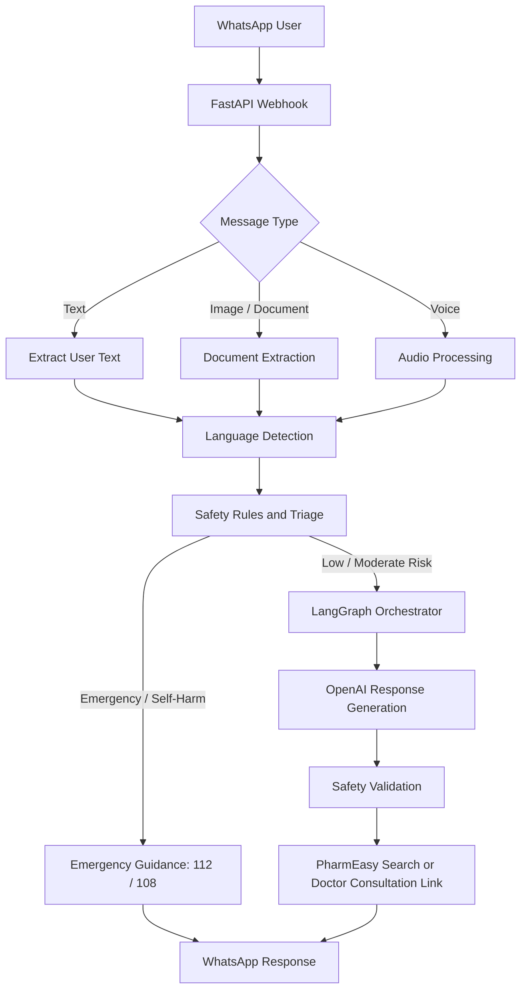

# WhatsApp Healthcare Assistant

A safety-first, AI-powered WhatsApp healthcare assistant built to make basic healthcare information more accessible for rural and semi-urban users in India.

The assistant supports text, voice notes, medical-document images, and WhatsApp messages. It detects the user’s language, identifies emergency situations before generating a response, provides simple health guidance, and shares relevant PharmEasy search or consultation links.

> **Medical disclaimer:** This project provides general health information only. It is not a diagnostic system, does not prescribe medicines, and must not replace a qualified healthcare professional.

## Features

- WhatsApp Cloud API webhook integration
- Text-based health conversations
- Multilingual support, including English, Hindi, and Hinglish
- Deterministic emergency and self-harm safety triage
- AI-powered low-risk and moderate-risk health guidance
- Medical report and document text extraction
- PharmEasy product-search suggestions
- Online doctor-consultation guidance
- LangGraph workflow orchestration
- Safety validation before sending the final WhatsApp response
- Automated pipeline and business-rule tests

## Workflow



## Project Structure

```text
app/
├── main.py                  # FastAPI server and WhatsApp webhook routes
├── config.py                # Application configuration and environment variables
├── orchestrator.py          # Healthcare assistant orchestration
├── language.py              # Language detection utilities
├── safety_rules.py          # Deterministic emergency and safety rules
├── document_extraction.py   # OCR and medical document extraction
├── whatsapp_client.py       # WhatsApp Cloud API client
├── graph/
│   ├── graph.py             # LangGraph workflow definition
│   ├── nodes.py             # Workflow nodes
│   └── state.py             # Workflow state schema
├── services/
│   └── llm.py               # OpenAI LLM service
└── tools/
    ├── medical_tools.py     # Healthcare-related tools
    └── pharmeasy_tools.py   # PharmEasy search and consultation tools

tests/
├── test_business_rules.py   # Safety and business-rule tests
└── test_pipeline.py         # End-to-end pipeline tests
```

## Safety Architecture

The assistant follows a safety-first decision flow:

1. Detect the message language and extract any relevant document text.
2. Apply deterministic rules for urgent symptoms and self-harm indicators.
3. Immediately provide emergency guidance for high-risk cases.
4. Use OpenAI only for low and moderate-risk informational responses.
5. Validate the generated answer to avoid diagnosis, unsafe dosage guidance, or false reassurance.
6. Direct users to a doctor when symptoms are serious, persistent, or unclear.

### Emergency Support in India

For an emergency, users are guided to contact:

- **112** — National emergency number
- **108** — Ambulance service

## Setup

### Prerequisites

- Python 3.10 or later
- Meta WhatsApp Cloud API credentials
- OpenAI API key
- ngrok, for local webhook testing

### Installation

```bash
git clone https://github.com/YOUR_GITHUB_USERNAME/whatsapp-healthcare-assistant.git
cd whatsapp-healthcare-assistant
python -m venv .venv
.venv\Scripts\activate
pip install -r requirements.txt
```

### Environment Variables

Create a local `.env` file:

```bash
copy .env.example .env
```

Add your own credentials to `.env`.

```env
OPENAI_API_KEY=your_openai_api_key
OPENAI_MODEL=gpt-4.1
WHATSAPP_VERIFY_TOKEN=your_verify_token
WHATSAPP_ACCESS_TOKEN=your_whatsapp_access_token
WHATSAPP_PHONE_NUMBER_ID=your_phone_number_id
```

Never commit `.env` or paste its values into GitHub.

## Run Locally

```bash
python -m uvicorn app.main:app --reload --port 8000
```

Health-check endpoint:

```text
http://127.0.0.1:8000/health
```

For local WhatsApp webhook testing:

```bash
ngrok http 8000
```

Use the generated HTTPS URL in the Meta WhatsApp webhook configuration.

## Testing

Run all tests:

```bash
python -m tests.test_business_rules
python -m tests.test_pipeline
```

## Tech Stack

- Python
- FastAPI
- OpenAI API
- LangChain and LangGraph
- WhatsApp Cloud API
- Pydantic
- Uvicorn
- OCR/document extraction utilities
- ngrok

## Future Improvements

- Voice-note transcription using faster-whisper
- More Indian-language support
- Approved medical RAG knowledge base
- Nearby hospital discovery from shared location
- Human-agent escalation for complex cases
- Monitoring, evaluation, and audit dashboard
- Consent and data-retention controls

## Disclaimer

This software is intended for informational and triage-support purposes only. It must not be used for diagnosis, prescription, emergency replacement, or as a substitute for professional medical care.
